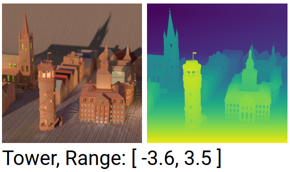

# CycleST
This is the official implementation of the paper "Self-Supervised Light Field Reconstruction Using Shearlet Transform and Cycle Consistency" ([ArXiv](https://arxiv.org/abs/2003.09294)). If you find this code useful in your research, please consider citing [1, 2] and 
```
@article{gao2020self,
  title={Self-Supervised Light Field Reconstruction Using Shearlet Transform and Cycle Consistency},
  author={Gao, Yuan and Bregovic, Robert and Gotchev, Atanas},
  journal={arXiv preprint arXiv:2003.09294},
  year={2020}
}
```
This code has been tested on an Ubuntu 18.04 system using Tensorflow 2.1. 
If you have any question, please contact Yuan Gao at <yuan.gao@tuni.fi>.

## Getting started ##
### 1. Python requirements ###
Follow the instructions on the [TensorFlow official website](https://www.tensorflow.org/install) to install TensorFlow 2. In addition, we need OpenCV for shearing-related operations: 
``` bash
pip install opencv-python
```
### 2. Prepare datasets ###
A demo dataset `./demo/tower_r_5` is prepared here. 
Speicifially, this demo dataset is the 5-th horizontal-parallax light field of the 4D light field `Tower` from the [4D Light Field Benchmark](https://lightfield-analysis.uni-konstanz.de/):  
  
As can be seen above, the demo 3D light field has minimum disparity -3.6 pixels and maximum disparity 3.5 pixels. 
In addition, the demo 3D light field `tower_r_5` has 9 images (`0001-0009.png`), of which each has the same size 512 x 512 pixels.   

### 3. Shearlet system construction
The construction of shearlet system comes from the public [software](http://www.cs.tut.fi/~vagharsh/EPISparseRec.html).
In order to generate the shearlet system that can be used by CycleST, we suggest to use the below code 
``` matlab
addpath('./shearlets');
height = 256; width = 672;
sys = constructShearlet([255, 255], 1:5, [height, width]); 
dec = sys.dec;
rec = sys.rec;
save(sprintf('st_%d_%d_5', height, width), 'dec', 'rec');
```
You may adjust the parameters `height` and `width` according to the size of your remapped EPIs.  

### 4. Light field reconstruction ###
The goal of this demo is to reconstruct the above demo 3D light field `tower_r_5` from a Sparsely-Sampled Light Field (SSLF) with only three images: `0001.png`, `0005.png` and `0009.png`.
In other words, to generate this SSLF, the interpolation rate should be set to 4. 
Besides, the generated input SSLF has minimum disparity -14.4 pixels, maximum disparity 14 pixels and disparity range 28.4 pixels. 
The pre-trained model of CycleST is suitable for light field reconstruction on any input SSLF with disparity range 16-32 pixels.  
Let's evaluate the light field reconstruction performance of CycleST by typing:
``` bash  
python predict.py --path_base=./demo --name_lf=tower_r_5 --angu_res_gt=9 --dmin=-3.6 --dmax=3.5 --interp_rate=4
```
The reconstructed light field is saved in `./demo/tower_r_5_lf_rec`. The intermediate results, i.e. reconstruced EPIs, are save in `./demo/tower_r_5_epi_rec`. 

## References ##
> [1] S. Vagharshakyan, R. Bregovic, and A. Gotchev, “Light field
reconstruction using shearlet transform,” IEEE TPAMI, vol. 40,
no. 1, pp. 133–147, 2018.  
> [2] S. Vagharshakyan, R. Bregovic, and A. Gotchev, “Accelerated
shearlet-domain light field reconstruction,” IEEE J-STSP, vol.
11, no. 7, pp. 1082–1091, 2017.

## Acknowledgments ##
> This work was supported by the project “Modeling and Visualization of Perceivable Light Fields” funded by Academy of Finland under grant No. 325530 and carried out with the support of [Centre for Immersive Visual Technologies (CIVIT)](https://civit.fi/) research infrastructure, Tampere University, Finland.